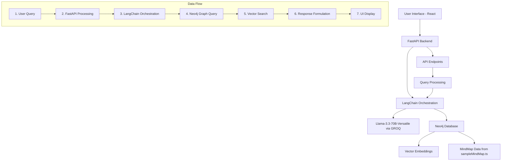

# Navigation Chatbot Architecture Diagram

The diagram below illustrates the architecture and data flow of the AI Navigation Chatbot system:

## Components Description

1. **User Interface (React)**: The frontend chat interface where users input navigation queries and receive responses.

2. **FastAPI Backend**: Provides the API endpoints for the frontend to communicate with the backend services.

3. **LangChain Orchestration**: Coordinates the different components of the system, including LLM interaction and database queries.

4. **Llama-3.3-70B-Versatile (via GROQ)**: The large language model responsible for understanding user queries and generating appropriate responses.

5. **Neo4j Database**: Stores the navigation structure as a graph, with nodes representing different sections and relationships defining connections.

6. **Vector Embeddings**: Transforms navigation nodes into vector representations for semantic search.

7. **API Endpoints**: Defined interfaces for query processing, navigation, and feedback.

8. **Query Processing**: Handles the interpretation of user queries before passing them to LangChain for orchestration.

The data flow section illustrates the sequential processing of a user query from input to response display. 